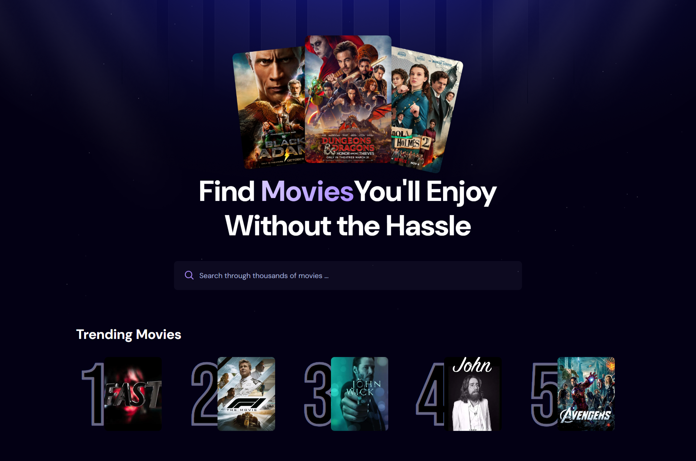

# 🎬 **MovieVerse — Discover Movies You’ll Love, Without the Hassle**

**MovieVerse** is a sleek and modern movie-exploration app built with **React** and **TailwindCSS**, designed for users who want fast, clean, and enjoyable movie browsing.  
Whether you're here to search through millions of titles or just want to see what’s trending today — MovieVerse has your back.

### ⚡ **TL;DR for the impatient:**

-   **Browse the latest released movies**
-   **Search across millions of titles**
-   **See the top 5 trending movies based on real user searches**
-   **Fully responsive UI for mobile & tablets**
-   **Smooth scrolling powered by Lenis**
-   **Powered by TMDB API + Appwrite** for data, search history, and trending logic

---

## 🚀 **Tech Stack**

---

## 🖼 **Preview**

---

## ✨ **Features**

### 🔥 **Newest Movies at Your Fingertips**

Stay up-to-date with the freshest releases pulled straight from the **TMDB API**. No more guessing what just dropped — it’s already here waiting for you.

### 🔍 **Search Through Millions of Movies**

A blazing-fast search experience that lets you find titles instantly. From vintage classics to 2025 blockbusters, nothing escapes **MovieVerse**.

### ⭐ **Top 5 Trending Movies**

Powered by **Appwrite**, the app tracks global search patterns and highlights the hottest movies everyone is looking for — in real time.

### 📱 **Fully Responsive & Beautifully Crafted UI**

Designed with **TailwindCSS** to look sharp and clean on any device: phones, tablets, desktops — you name it.

### 🎚 **Ultra-Smooth Scrolling with Lenis**

The entire app features buttery-soft, silky-smooth scrolling thanks to **Lenis**, making the browsing experience feel premium and fluid.

### ⚡ **Smooth, Modern, and Lightweight**

Minimal code, maximum performance. Movie browsing feels fast, soft, and seamless.

---

## 📜 **License**

This project is licensed under the **MIT License**.  
Feel free to use it, modify it, extend it, or build something even cooler with it.
